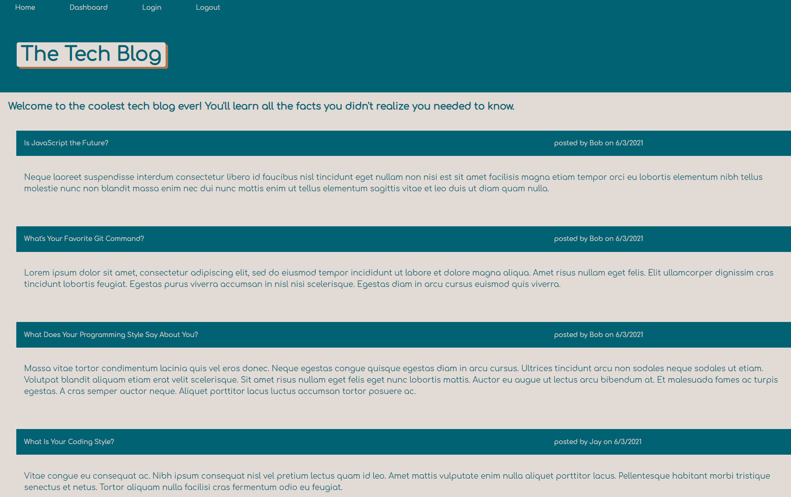
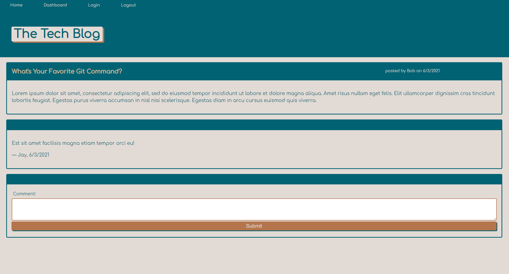

# Tech Blog

## Description

Want to tell the world about your tech knowledge?

This blog will give you a platform to tell the world about all of your tech facts. Simply sign-up for an account after clicking through login, then you'll be able to create new posts via the Dashboard's New Post button. After you've posted your knowledge, it'll show up on the home page where you can leave comments on other people's posts, too. You can edit or delete your post at any time by going back to the Dashboard and clicking on the post that needs modified. If you're inactive for thirty seconds, you'll be logged out automatically and required to login again.

Get ready to spread your knowledge and connect with the tech world through this helpful blog!

This blog was written in JavaScript using Express.js, Sequelize, Node.js, MySQL/JawsDB, Handlebars, and CSS. It's deployed on Heroku.

## Table of Contents

* [Description](#description)
* [Installation](#installation)
* [Usage](#usage)
* [Credits](#credits)
* [License](#license)

## Installation

To install the application's dependencies, type the following:
```md
npm install
```
To run the server after you've added the schema.sql to your MySQL Workbench, type the following:
```md
npm start
```
Once those steps are done, you can view the application in your browser using localhost:3001.

## Usage



Navigate to [Soma Mäkelä's Tech Blog](https://frozen-hollows-70537.herokuapp.com/) and view the web page.

* Once you're there, sign-up for an account after clicking through login.
* Create posts via the Dashboard's New Post button.
* Edit or delete your posts on the Dashboard.
* View and comment on posts on the Home page.
* Inactivity for 30 seconds will require logging in again.



## Credits

Created by [Soma Makela](https://github.com/smakela13).

## License

This website currently has No License, which means it is under exclusive copyright. No one can copy, distribute, or modify this website without permission.